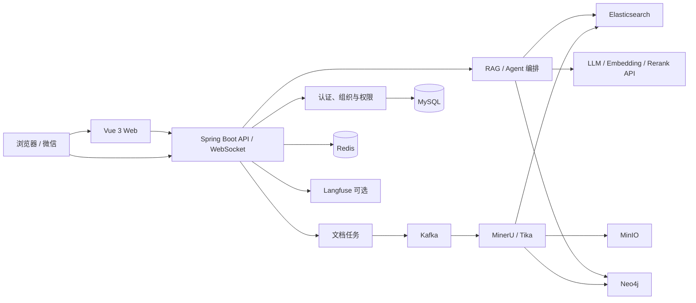

<div align="center">
  

# 知枢 NexusMind

面向团队与组织的 AI 知识库：把分散文档转化为可检索、可追溯、可治理的知识。

[](backend/pom.xml)
[](backend/pom.xml)
[](frontend/package.json)
[](frontend/package.json)
[](https://github.com/Lukyyyyy/nexusmind/stargazers)

**简体中文** · [English](README_EN.md)

[功能概览](#功能概览) · [快速开始](#快速开始) · [系统架构](#系统架构) · [生产部署](#生产部署) · [参与贡献](#参与贡献)
</div>

---

NexusMind 是一套基于 RAG（检索增强生成）的全栈知识管理系统。它覆盖文档接入、解析与索引、混合检索、知识图谱、模型配置、权限治理、AI 问答和可观测性，适合搭建团队内部知识助手或企业知识中台。

> 项目仍在持续迭代。生产环境部署前，请先审查安全配置、资源预算和外部模型的数据合规要求。

## 功能概览

| 能力 | 说明 |
| --- | --- |
| AI 问答 | WebSocket 流式会话、会话历史、知识范围选择、来源引用与 Markdown/公式/代码渲染 |
| RAG 检索 | Elasticsearch 关键词与向量双路召回、RRF 融合、可选 Rerank、上下文补全 |
| 文档处理 | 分片上传、类型校验、Kafka 异步任务、MinerU 解析、Tika 回退、失败重试与进度推送 |
| 知识图谱 | Neo4j 多跳检索、候选关系审核发布、文档级开关与重建、组织图谱可视化 |
| 权限与组织 | 公开、组织、个人三类知识空间；组织申请审批、成员管理、角色控制与审计 |
| 模型管理 | LLM、Embedding、Rerank 配置；系统/用户级偏好、用量统计、定价规则与配额 |
| Agent 工具 | 可按需调用知识检索、图谱检索、文档列表和分块上下文工具 |
| IM 接入 | 微信 ClawBot/iLink 扫码接入、消息异步分发与群聊提及策略 |
| 通知与邮件 | 站内通知、邮箱验证、SMTP 或腾讯云 SES |
| 可观测性 | 可选 Langfuse 链路追踪、调用详情、Token 与费用概览 |

### 当前功能边界

- IM 渠道目前实现微信 ClawBot/iLink；企业微信、飞书等适配器尚未实现。
- Embedding 向量维度固定为 `2048`，切换模型时需确保兼容。
- 未配置模型密钥时系统可以启动，但 AI 问答、向量化及相关处理不可用。
- 知识图谱可关闭；关闭后不影响基础文档检索与问答。

## 系统架构



后端采用 Spring Boot 分层结构，文档处理通过 Kafka 解耦；检索数据写入 Elasticsearch，原始文件存放在 MinIO，已审核的实体关系写入 Neo4j。Redis 用于缓存、限流及短期凭据，MySQL 保存业务数据。

## 技术栈

- **前端：** Vue 3、TypeScript、Vite、Naive UI、Pinia、Vue Router、UnoCSS、ECharts、AntV G6
- **后端：** Java 17、Spring Boot 3.4、Spring Security、Spring Data JPA、WebSocket、WebFlux、Flyway
- **数据与中间件：** MySQL 8、Redis 7、Kafka、Elasticsearch 8.10、MinIO、Neo4j 5.26
- **AI 与解析：** OpenAI 兼容模型 API、DeepSeek、DashScope Embedding/Rerank、MinerU、Apache Tika、Langfuse

## 快速开始

### 环境要求

- Java 17、Maven 3.8.6+
- Node.js 18.20.0+、pnpm 8.7.0+
- Docker 与 Docker Compose（推荐，用于启动中间件）
- macOS 或 Linux Bash 环境；Windows 建议使用 WSL 2

### 一键启动开发环境

```bash
git clone https://github.com/Lukyyyyy/nexusmind.git
cd nexusmind
cp .env.example .env.local
./scripts/start.sh dev
```

启动后访问：

- Web：<http://localhost:9527>
- 后端健康检查：<http://localhost:18081/actuator/health>
- MinIO 控制台：<http://localhost:19001>
- Neo4j Browser：<http://localhost:17474>

本地管理员账号由 `.env.local` 中的 `ADMIN_USERNAME` 和 `ADMIN_PASSWORD` 决定。`.env.example` 仅用于本地开发，请勿沿用其中的示例密码部署生产环境。

### 配置 AI 能力

```dotenv
DEEPSEEK_API_KEY=your-llm-key
EMBEDDING_API_KEY=your-embedding-key
```

也可以启动后在“模型配置”页面添加 LLM、Embedding 和 Rerank 服务。LLM 与 Embedding 支持 OpenAI 风格接口，Rerank 支持 DashScope 接口；Embedding 模型必须输出 `2048` 维向量。

### 其他启动方式

```bash
# 使用 Homebrew 中间件
./scripts/start.sh dev --infra=homebrew

# 复用已运行的中间件
./scripts/start.sh dev --infra=none

# 仅启动 Docker 中间件；增加 --with-mineru 可要求 MinerU 就绪
./scripts/start.sh infra

# 分别启动后端或前端
./scripts/start.sh backend
./scripts/start.sh frontend
```

完整参数可运行 `./scripts/start.sh --help` 查看。

## 配置说明

- [`.env.example`](.env.example)：本地开发模板，复制为 `.env.local`。
- [`.env.deploy.example`](.env.deploy.example)：生产部署模板，由准备脚本生成 `.env.deploy.local`。

| 分类 | 环境变量 | 用途 |
| --- | --- | --- |
| 基础安全 | `JWT_SECRET_KEY`、`ADMIN_PASSWORD` | JWT 签名与初始管理员密码 |
| 模型 | `DEEPSEEK_API_KEY`、`EMBEDDING_API_KEY` | 默认 LLM 与向量模型凭据 |
| 存储 | `MYSQL_PASSWORD`、`REDIS_PASSWORD`、`MINIO_*` | 业务数据库、缓存与对象存储 |
| 检索 | `ELASTICSEARCH_PASSWORD`、`AI_RETRIEVAL_*` | 混合召回、Rerank 开关与超时 |
| 图谱 | `KNOWLEDGE_GRAPH_ENABLED`、`NEO4J_*` | 知识图谱与 Neo4j 连接 |
| 文档解析 | `MINERU_*` | MinerU 地址、后端、OCR、表格与公式解析 |
| 可观测性 | `LANGFUSE_*` | Langfuse 追踪、环境和内容采集策略 |
| 邮件 | `MAIL_PROVIDER`、`TENCENT_SES_*` | SMTP 或腾讯云 SES |
| 公网访问 | `APP_PUBLIC_URL`、`APP_WEBSOCKET_ALLOWED_ORIGINS` | 站点地址与 WebSocket 来源白名单 |

所有可用项及默认值以两个环境变量模板和 [`application.yml`](backend/src/main/resources/application.yml) 为准。

## 生产部署

生产编排复用已有的 `mysql`、`redis`、`minio` 容器，并要求存在 `server_proxy` 外部网络。准备脚本会生成随机凭据、初始化数据库和 MinIO，并创建 `shared_services` 网络。

```bash
./scripts/prepare-deployment.sh

# 审查并补全公网地址、模型与邮件配置
${EDITOR:-vi} .env.deploy.local

docker compose --env-file .env.deploy.local \
  -f docker-compose.deploy.yml up -d --build
```

后续可选择性部署；构建成功且健康检查通过后才替换在线容器：

```bash
./scripts/deploy.sh backend
./scripts/deploy.sh frontend
./scripts/deploy.sh all

# 回滚到最近保留的镜像
./scripts/deploy.sh rollback all
```

部署脚本不会操作 Git 或数据卷，前端构建时会临时暂停 MinerU 以控制内存。数据库迁移不会随镜像回滚，请在生产操作前备份持久化数据。更多约束见 [`docker-compose.deploy.yml`](docker-compose.deploy.yml) 与脚本内帮助。

## 项目结构

```text
NexusMind/
├── backend/                  # Spring Boot API、WebSocket 与异步任务
│   ├── docs/                 # 本地中间件、MinerU、Elasticsearch 配置
│   └── src/main/java/com/luky/nexusmind/
│       ├── agent/            # Agent 编排与工具
│       ├── client/           # 模型及外部服务客户端
│       ├── config/           # 安全、数据源与基础设施配置
│       ├── consumer/         # Kafka 文档消费者
│       ├── controller/       # REST API
│       ├── handler/          # WebSocket 处理
│       ├── im/               # IM 适配、网关与消息分发
│       ├── model/            # 领域模型
│       ├── repository/       # 数据访问
│       └── service/          # 业务服务
├── frontend/                 # Vue 3 主应用
├── homepage/                 # 独立静态产品介绍页
├── scripts/                  # 本地启动、部署与回滚脚本
└── docker-compose.deploy.yml # 生产容器编排
```

## 开发与验证

```bash
# 后端
cd backend
mvn test
mvn clean package

# 前端
cd frontend
pnpm install
pnpm typecheck
pnpm build
```

修改前请先阅读 [`AGENTS.md`](AGENTS.md) 中的项目约定。请勿提交真实密钥、`.env.local`、`.env.deploy.local` 或包含访问票据的完整下载链接。

## 参与贡献

欢迎通过 [Issue](https://github.com/Lukyyyyy/nexusmind/issues) 报告可复现的问题或提出需求，也欢迎提交 Pull Request。PR 请说明改动范围、兼容性或迁移影响、测试结果，并为界面改动附上截图。

## 许可证

仓库当前尚未包含独立的 `LICENSE` 文件。在许可证补充前，请勿假设本项目已授予复制、修改或再分发权限。
