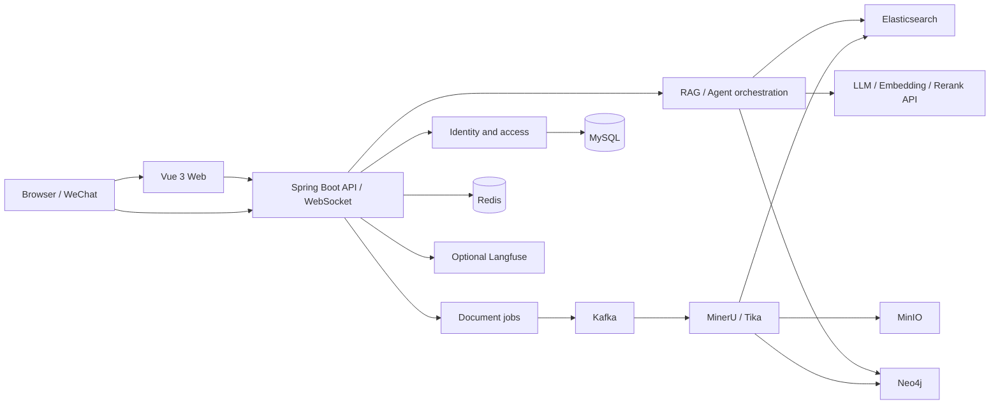

<div align="center">
  

# NexusMind

An AI knowledge base for teams and organizations—turn scattered documents into searchable, traceable, and governed knowledge.

[](backend/pom.xml)
[](backend/pom.xml)
[](frontend/package.json)
[](frontend/package.json)
[](https://github.com/Lukyyyyy/nexusmind/stargazers)

[简体中文](README.md) · **English**

[Features](#features) · [Quick Start](#quick-start) · [Architecture](#architecture) · [Production Deployment](#production-deployment) · [Contributing](#contributing)
</div>

---

NexusMind is a full-stack knowledge management system built around retrieval-augmented generation (RAG). It covers document ingestion, hybrid retrieval, knowledge graphs, model configuration, access governance, AI chat, and observability. It can serve as an internal knowledge assistant or the foundation of an enterprise knowledge platform.

> NexusMind is under active development. Before deploying it to production, review its security settings, resource budget, and the data-compliance requirements of every external model provider.

## Features

| Capability | Description |
| --- | --- |
| AI chat | WebSocket streaming, history, knowledge scopes, source citations, and rich Markdown rendering |
| RAG retrieval | Elasticsearch lexical/vector retrieval, RRF fusion, optional reranking, and context expansion |
| Document pipeline | Chunked uploads, validation, Kafka jobs, MinerU parsing, Tika fallback, retries, and live progress |
| Knowledge graph | Neo4j multi-hop retrieval, candidate review/publishing, rebuilds, and graph visualization |
| Access governance | Public, organization, and personal spaces; membership approval, roles, administration, and audits |
| Model management | LLM, embedding, and rerank configs; preferences, usage, pricing rules, and quotas |
| Agent tools | Knowledge search, graph search, document listing, and chunk-context tools |
| IM integration | WeChat ClawBot/iLink QR-code setup, async dispatch, and group-mention policy |
| Notifications and email | In-app notifications, email verification, SMTP, or Tencent Cloud SES |
| Observability | Optional Langfuse traces, request details, token usage, and cost overview |

### Current boundaries

- WeChat ClawBot/iLink is the only implemented IM adapter; WeCom and Feishu are not implemented yet.
- Embedding vectors are fixed at `2048` dimensions, so replacement models must be compatible.
- The app starts without model credentials, but AI chat, embeddings, and dependent processing will not work.
- The knowledge graph is optional and does not affect basic document retrieval when disabled.

## Architecture



The Spring Boot backend separates synchronous APIs from Kafka-backed document processing. Search data lives in Elasticsearch, source files in MinIO, and reviewed relationships in Neo4j. Redis handles caching, rate limits, and short-lived credentials; MySQL stores application data.

## Technology stack

- **Frontend:** Vue 3, TypeScript, Vite, Naive UI, Pinia, Vue Router, UnoCSS, ECharts, AntV G6
- **Backend:** Java 17, Spring Boot 3.4, Spring Security, Spring Data JPA, WebSocket, WebFlux, Flyway
- **Data:** MySQL 8, Redis 7, Kafka, Elasticsearch 8.10, MinIO, Neo4j 5.26
- **AI and parsing:** OpenAI-compatible APIs, DeepSeek, DashScope, MinerU, Apache Tika, Langfuse

## Quick start

### Prerequisites

- Java 17 and Maven 3.8.6+
- Node.js 18.20.0+ and pnpm 8.7.0+
- Docker and Docker Compose (recommended)
- macOS or Linux Bash; use WSL 2 on Windows

```bash
git clone https://github.com/Lukyyyyy/nexusmind.git
cd nexusmind
cp .env.example .env.local
./scripts/start.sh dev
```

Open the Web UI at <http://localhost:9527> and the backend health check at <http://localhost:18081/actuator/health>. Local administrator credentials come from `ADMIN_USERNAME` and `ADMIN_PASSWORD` in `.env.local`; never reuse the example passwords in production.

### Enable AI features

```dotenv
DEEPSEEK_API_KEY=your-llm-key
EMBEDDING_API_KEY=your-embedding-key
```

Models can also be added from the Model Configuration page. LLM and embedding services support OpenAI-style APIs, while reranking supports the DashScope API. The embedding model must produce `2048`-dimension vectors.

### Other startup modes

```bash
./scripts/start.sh dev --infra=homebrew # Homebrew infrastructure
./scripts/start.sh dev --infra=none     # Reuse running infrastructure
./scripts/start.sh infra                # Docker infrastructure only
./scripts/start.sh backend              # Backend only
./scripts/start.sh frontend             # Frontend only
```

Run `./scripts/start.sh --help` for the complete command reference.

## Configuration

- [`.env.example`](.env.example): copy to `.env.local` for development.
- [`.env.deploy.example`](.env.deploy.example): production template used to create `.env.deploy.local`.

| Category | Environment variables | Purpose |
| --- | --- | --- |
| Security | `JWT_SECRET_KEY`, `ADMIN_PASSWORD` | JWT signing and initial administrator |
| Models | `DEEPSEEK_API_KEY`, `EMBEDDING_API_KEY` | Default LLM and embedding credentials |
| Storage | `MYSQL_PASSWORD`, `REDIS_PASSWORD`, `MINIO_*` | Database, cache, and object storage |
| Retrieval | `ELASTICSEARCH_PASSWORD`, `AI_RETRIEVAL_*` | Hybrid retrieval and reranking |
| Graph | `KNOWLEDGE_GRAPH_ENABLED`, `NEO4J_*` | Knowledge graph and Neo4j connection |
| Parsing | `MINERU_*` | Parser endpoint, backend, OCR, tables, and formulas |
| Observability | `LANGFUSE_*` | Tracing and content-capture policy |
| Public access | `APP_PUBLIC_URL`, `APP_WEBSOCKET_ALLOWED_ORIGINS` | Public URL and origin allowlist |

See the templates and [`application.yml`](backend/src/main/resources/application.yml) for all values and defaults.

## Production deployment

Production Compose reuses existing containers named `mysql`, `redis`, and `minio`, and expects an external `server_proxy` network. The preparation script generates credentials, initializes services, and creates the `shared_services` network.

```bash
./scripts/prepare-deployment.sh
${EDITOR:-vi} .env.deploy.local
docker compose --env-file .env.deploy.local \
  -f docker-compose.deploy.yml up -d --build
```

```bash
./scripts/deploy.sh backend
./scripts/deploy.sh frontend
./scripts/deploy.sh all
./scripts/deploy.sh rollback all
```

The deployment script does not modify Git or data volumes. Database migrations are not reverted with images, so back up persistent data first. See [`docker-compose.deploy.yml`](docker-compose.deploy.yml) and the scripts' help for details.

## Repository layout

```text
NexusMind/
├── backend/                  # Spring Boot APIs, WebSocket, and async jobs
│   └── src/main/java/com/luky/nexusmind/
│       ├── agent/            # Agent orchestration and tools
│       ├── client/           # Model and external-service clients
│       ├── config/           # Security and infrastructure config
│       ├── consumer/         # Kafka consumers
│       ├── controller/       # REST APIs
│       ├── im/               # IM adapters and dispatch
│       ├── repository/       # Data access
│       └── service/          # Business services
├── frontend/                 # Main Vue 3 application
├── homepage/                 # Standalone product site
├── scripts/                  # Startup, deployment, and rollback
└── docker-compose.deploy.yml # Production topology
```

## Development and verification

```bash
cd backend && mvn test
cd backend && mvn clean package
cd frontend && pnpm install
cd frontend && pnpm typecheck
cd frontend && pnpm build
```

Read [`AGENTS.md`](AGENTS.md) before making changes. Never commit secrets, local environment files, or complete download URLs containing access tickets.

## Contributing

Use [GitHub Issues](https://github.com/Lukyyyyy/nexusmind/issues) for reproducible bugs and proposals. Pull requests should explain their scope, compatibility or migration impact, test results, and include screenshots for UI changes.

## License

This repository does not currently contain a standalone `LICENSE` file. Until one is added, do not assume that permission to copy, modify, or redistribute the project has been granted.
